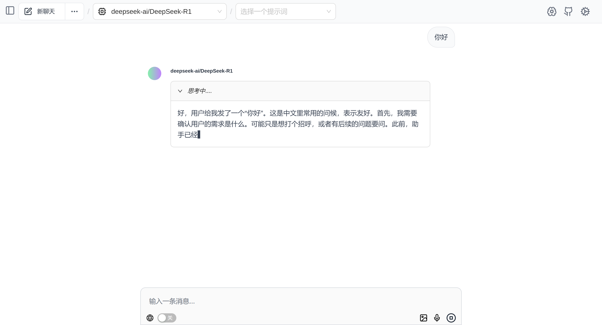

# FlowSilicon

<p align="center">
  
  
  
</p>

FlowSilicon 是一个专为硅基流动 API 设计的高性能代理服务，提供全面的 API 密钥管理、智能负载均衡、请求转发和实时监控功能。通过 FlowSilicon，您可以更高效地管理和使用硅基流动的各种 AI 服务，同时获得直观友好的 Web 管理界面。


## 截图


### 沉浸式翻译

> [!note]
>
> + 建议设置
>   + 每秒最大请求数：20
>   + 每次请求最大文本长度: 1500
>   + 每次请求最大段落数：50


### Page Assist



### Cherry Studio


## ✨ 核心功能

### 🔑 API 密钥管理

FlowSilicon 提供全面的 API 密钥管理功能：

- **多种添加方式**：支持单个添加和批量添加 API 密钥
- **自动余额检测**：自动检测 API 密钥余额，无需手动输入
- **本地安全存储**：所有 API 密钥安全存储在本地，不会上传到任何第三方服务
- **智能密钥轮询**：支持三种 API 密钥使用模式（单独使用、全部轮询、选中轮询）
- **多维度智能排序**：根据余额(40%)、成功率(30%)、RPM(15%)和TPM(15%)的加权评分自动排序 API 密钥
- **自动故障处理**：连续失败超过阈值的 API 密钥会被自动禁用，并定期尝试恢复
- **模型特定策略**：针对不同模型可设置不同的密钥选择策略（高成功率、高分数、低RPM、低TPM、高余额）

### 🔄 请求代理与转发

- **智能重试机制**：可配置的重试策略，对网络错误和特定状态码自动重试
- **高级流式处理**：完整支持 OpenAI 的流式响应（SSE）处理，实现实时交互体验
- **自适应延迟算法**：根据内容大小和生成速度动态调整响应速率，优化用户体验

### 📊 性能监控与统计

- **实时请求速率监控**：直观显示每分钟请求数（RPM）和每分钟令牌数（TPM）
- **密钥使用统计**：详细记录每个 API 密钥的调用次数、成功率等关键指标
- **余额监控**：定时检测 API 密钥余额，自动处理低余额和零余额密钥
- **日志查看**：提供便捷的日志查看功能，快速定位和排查问题
- **资源使用分析**：分析并展示 API 资源使用情况，帮助优化成本

### 🌐 系统集成与易用性

- **系统托盘集成**：支持在系统托盘中运行，节省桌面空间
- **自启动支持**：可配置为系统启动时自动运行
- **代理支持**：支持 HTTP、HTTPS 和 SOCKS5 代理，解决网络访问问题
- **直观的 Web 界面**：友好的用户界面，简化管理操作
- **自动更新刷新**：配置灵活的自动刷新间隔，保持数据实时性


## 🚀 安装与使用

### 📥 直接下载

1. 从 [蓝奏云](https://hanhaii.lanzouo.com/b00ya2hfte) <u>密码:ggha</u>  or [Releases](https://github.com/HanHai-Space/FlowSilicon/releases) 页面下载最新版本的可执行文件
2. 解压缩下载的压缩包
3. 双击运行 `flowsilicon.exe`
4. 系统将自动打开浏览器访问管理界面（默认地址：http://localhost:3201）

> [!note]
>
> 会自动缩小的任务栏


### 📥 从源码构建

```bash
# 克隆仓库
git https://github.com/HanHai-Space/FlowSilicon.git
cd flowsilicon

# 构建
go build -o flowsilicon cmd/flowsilicon/main.go

# 运行
./flowsilicon
```

## ⚙️ 配置说明

FlowSilicon 使用 YAML 格式的配置文件 `config/config.yaml`，支持以下配置项：

```yaml
# API代理配置
api_proxy:
  # API基础URL，用于转发请求
  base_url: https://api.siliconflow.cn
  # 重试配置
  retry:
    # 最大重试次数，0表示不重试
    max_retries: 2
    # 重试间隔（毫秒）
    retry_delay_ms: 1000
    # 是否对特定错误码进行重试
    retry_on_status_codes: [500, 502, 503, 504]
    # 是否对网络错误进行重试
    retry_on_network_errors: true

# 代理设置
proxy:
  # HTTP代理地址，格式为 http://host:port，留空表示不使用代理
  http_proxy: ""
  # HTTPS代理地址，格式为 https://host:port，留空表示不使用代理
  https_proxy: ""
  # SOCKS5代理地址，格式为 host:port，留空表示不使用代理
  socks_proxy: "127.0.0.1:10808"
  # 代理类型：http, https, socks5
  proxy_type: "socks5"
  # 是否启用代理
  enabled: false

# 服务器配置
server:
  # 服务器监听端口
  port: 3201

# 日志配置
log:
  # 日志文件最大大小（MB），超过此大小的日志将被清理
  max_size_mb: 1

# 应用程序配置
app:
  # 应用程序标题，显示在Web界面上
  title: "流动硅基 FlowSilicon"
  # 最低余额阈值，低于此值的API密钥将被自动禁用
  min_balance_threshold: 0.8
  # 余额显示的最大值，用于前端显示进度条
  max_balance_display: 14
  # 每页显示的密钥数量
  items_per_page: 5
  # 最大统计条目数，用于限制请求统计的历史记录数量
  max_stats_entries: 60
  # 恢复检查间隔（分钟），系统会每隔此时间尝试恢复被禁用的密钥
  recovery_interval: 10
  # 最大连续失败次数，超过此值的密钥将被自动禁用
  max_consecutive_failures: 5
  # 是否隐藏系统托盘图标
  hide_icon: false

  # 权重配置
  balance_weight: 0.4     # 余额评分权重（默认0.4，即40%）
  success_rate_weight: 0.3 # 成功率评分权重（默认0.3，即30%）
  rpm_weight: 0.15        # RPM评分权重（默认0.15，即15%）
  tpm_weight: 0.15        # TPM评分权重（默认0.15，即15%）
  
  # 自动更新配置
  stats_refresh_interval: 10  # 统计信息自动刷新间隔（秒）
  rate_refresh_interval: 15   # 速率监控自动刷新间隔（秒）
  auto_update_interval: 10   # API密钥状态自动更新间隔（秒）
  
  # 模型特定的密钥选择策略
  # 策略ID: 1=高成功率, 2=高分数, 3=低RPM, 4=低TPM, 5=高余额
  model_key_strategies:
    "deepseek-ai/DeepSeek-V3": 1  # 使用高成功率策略
```


## 📄 许可证

FlowSilicon 使用 [MIT 许可证](LICENSE)。 